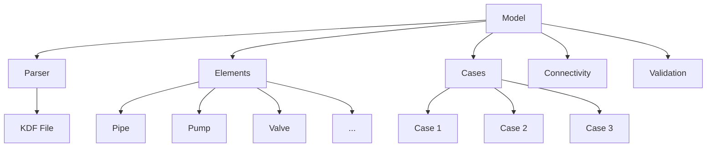

# Core Concepts

Understanding the fundamental concepts of pyKorf.

## Architecture Overview



## Key Concepts

### Model Persistence Contract

The most important concept in pyKorf is the **persistence contract**:

1. **Load**: `Model(path)` reads the KDF file into memory
2. **Modify**: All operations modify only the in-memory state
3. **Save**: Changes are written only when you call `model.save()` or `model.save_as()`

```python
model = Model("input.kdf")  # 1. Load
model.update_element(...)    # 2. Modify (in memory only)
model.save("output.kdf")     # 3. Save
```

!!! warning "Unsaved Changes"
    If you don't call `save()`, all changes are lost when the Python process ends.

### Element Indexing

Every element type in KORF has:

- **Index 0**: Default template (defines default values)
- **Index 1+**: Real instances

```python
# Template (index 0)
template = model.pipes[0]  # Default values for new pipes

# Real instances (index 1+)
pipe1 = model.pipes[1]
pipe2 = model.pipes[2]
```

### KDF File Format

Understanding the KDF format helps when working with pyKorf:

| Aspect | Detail |
|--------|--------|
| **Encoding** | `latin-1` (not UTF-8) |
| **Line Endings** | `\r\n` (Windows CRLF) |
| **Multi-case** | Semicolon-delimited: `"50;55;20"` |
| **Calculated** | Marked with `";C"` suffix |
| **Format** | `\ETYPE,index,PARAM,value,...` |

Example KDF record:
```csv
"\PIPE",1,"TFLOW","50;55;20",20,"t/h"
```

This represents:
- Element type: PIPE
- Index: 1
- Parameter: TFLOW
- Values: input="50;55;20", calculated=20, unit="t/h"

### Element Types

| KDF Keyword | pyKorf Class | Description |
|-------------|--------------|-------------|
| `\GEN` | `General` | Global settings |
| `\PIPE` | `Pipe` | Process line/pipe |
| `\PUMP` | `Pump` | Centrifugal or PD pump |
| `\VALVE` | `Valve` | Control valve |
| `\FEED` | `Feed` | Source boundary |
| `\PROD` | `Product` | Sink boundary |
| `\HX` | `HeatExchanger` | Heat exchanger |
| `\COMP` | `Compressor` | Compressor |
| `\VESSEL` | `Vessel` | Pressure vessel |
| `\TEE` | `Tee` | Tee piece |
| `\JUNC` | `Junction` | Multi-pipe junction |

### Constants and Definitions

**Always use constants** from `pykorf.definitions` instead of hardcoded strings:

```python
# CORRECT
from pykorf.definitions import Element, Pipe, Common

model.add_element(Element.PIPE, "L1", {Pipe.LEN: 100})

# INCORRECT
model.add_element("PIPE", "L1", {"LEN": 100})
```

### Multi-Case Values

KORF supports running multiple scenarios (cases) in a single file:

```python
# Single value applies to all cases
model.update_element("L1", {Pipe.TFLOW: "50"})

# Multi-case values (3 cases)
model.update_element("L1", {Pipe.TFLOW: "50;55;20"})
```

### Connectivity Model

In KORF, pipes are the "edges" and equipment are "nodes":

```
Feed → Pipe → Pump → Pipe → Product
```

- **Pipes** don't have explicit connections; they're referenced by other elements
- **Equipment** (Pump, Valve, etc.) have `CON` records: `[inlet_pipe, outlet_pipe]`
- **Boundaries** (Feed, Product) have `NOZL` records referencing one pipe

## Design Patterns

### Fluent Interface

Many pyKorf APIs support method chaining:

```python
from pykorf import Query, attr

results = (
    Query(model)
    .pipes
    .where(attr("diameter_inch") == "6")
    .where(attr("length_m") > 100)
    .order_by("name")
    .all()
)
```

### Context Managers

Use context managers for structured operations:

```python
from pykorf.log import log_operation

with log_operation("process_model", path="model.kdf"):
    model = Model("model.kdf")
    model.validate()
    model.save()
```

### Type Safety

pyKorf provides Pydantic models for type-safe data handling:

```python
from pykorf.types import PipeData, FlowParameters

pipe = PipeData(
    name="L1",
    diameter_inch="6",
    length_m=100.0,
    flow=FlowParameters(mass_flow_t_h=[50, 55, 20])
)
```

## Next Steps

- [Loading Models](../user-guide/loading-models.md)
- [Working with Elements](../user-guide/working-with-elements.md)
- [Multi-Case Analysis](../user-guide/multi-case-analysis.md)
